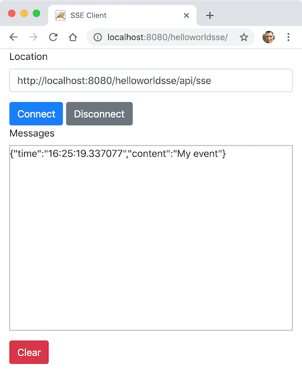

# Projet sse-helloworld-war

Cet exemple montre comment déployer une application serveur qui utilise la technologie Server-Sent Events et le langage Java avec JAX-RS 2.1 et Jersey sur un serveur d'application Tomcat. Plus précisement il est expliqué comment déployer un fichier war avec un conteneur Docker basé sur une image Tomcat.

Un client HTML/JavaScript a été développé pour tester nos différentes ressources (répertoire _static/_).



## Comment compiler

* À la racine du projet, exécuter la ligne de commande suivante :

```console
mvn clean package
```

## Comment déployer

* Exécuter la ligne de commande suivante pour télécharger l'image Docker correspondant à la version 9 de Tomcat s'exécutant sous un JRE 11

```console
docker pull tomcat:9-jre11-slim
```

* Exécuter la ligne de commande suivante permettant de créer un conteneur Docker

```console
docker run --rm --name helloworldsse-tomcat -v $(pwd)/target/helloworldsse.war:/usr/local/tomcat/webapps/helloworldsse.war -it -p 8080:8080 tomcat:9-jre11-slim
```

## Tester

* Depuis un navigateur web, saisir l'URL suivante <http://localhost:8080/helloworldsse/> sur un onglet.

* Appuyer sur **Connect**.

* Exécuter la requête suivante depuis la ligne de commande pour envoyer le contenu *My Event* au serveur afin de créer un événement SSE qui sera transmis aux deux clients.

```console
curl --request POST --data 'My event' http://localhost:8080/helloworldsse/api/sse
Message 'My event' has been broadcast.
```

**Résultat :** visualiser le résultat dans la zone *Messages* de l'interface web.
